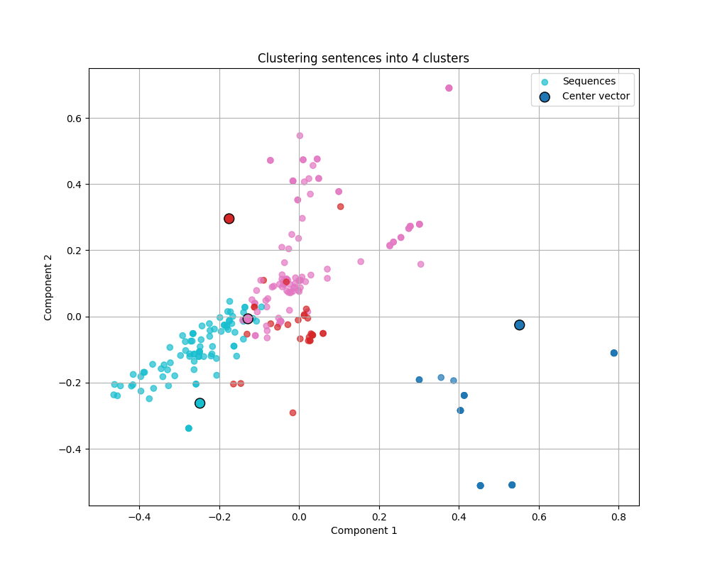
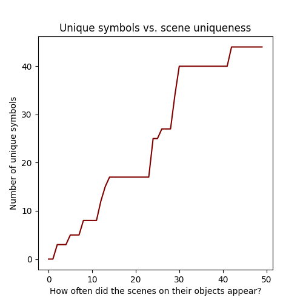
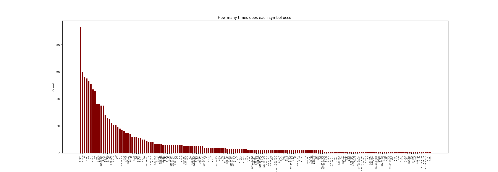
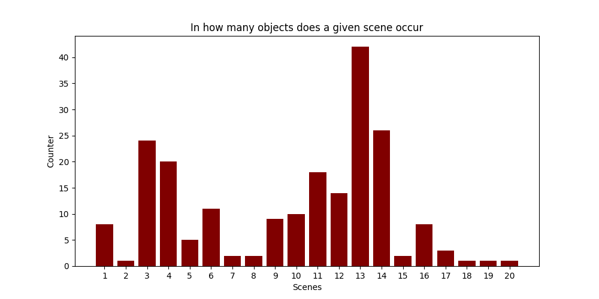

# Znaki Tokapi - analiza.

## O czym tu piszemy?
Naszym zadaniem było poddanie analizie sekwencji znaków tokapi w celu wyciągnięcia z nich jak największyej ilości informacji. 
Większość hipotez, które zdecydowaliśmy się sprawdzić okazała się być ślepymi zaułkami, lecz udało nam się odnaleźć parę wartościowych informacji na temat tego zbioru danych.

## Wykorzystywane metody
Postanowiliśmy podejść do tego zadania od paru różnych stron:

### 1. Klasteryzacja
Wykorzystywaliśmy wiele metod do klasteryzacji, jednak większość z nich okazała się być nieadekwatna do naszych danych. Głównym problemem okazało się bardzo mocne zróżnicowanie danych, niektóre metody też mają narzuconą od góry ilość klusterów które generują. Ustalenie tej liczby okazało się mało efektywne i nie dawało satysfakcjonujących wyników.

\
*Klastery stworzone za pomocą algorytmu KMeans. Wykres ten przedstawia spłaszczenia naszych wektorów i centroidów do 2 wymiarów za pomocą PCA. Klastery były oceniane na podstawie ich zawartości, nie tego wykresu.*

Późniejsze próby klasteryzacji były wykonywane za pomocą algorytmów generujących dynamiczną liczbę klasterów. Udało nam się wykazać, że niektóre sekwencje się powtarzają bardzo często proporcjonalnie do całego zestawu danych, np. istnieje 44 sekwencji, w których przynajmniej połowa symboli pokrywa się z poniższą sekwencją:
<b>['B.24.11', 'B.31.28', 'A.6', 'B.24.28.7', 'A.38', 'B.29.30.10', 'E.31.20', 'B.27.30']
</b>

Sugeruje to, że część naczyń była bardzo do siebie podobna, lecz było także wiele unikatowych egzemplarzy (o czym świadczy ilość klusterów nie mniejsza od 40 w przestrzeni 256 sekwencji).

### 2. Korelacja
Korelacja okazała się bym potężnym narzędziem, lecz tylko gdy używaliśmy jej do potwierdzania/obalania własnych hipotez.\
Jedną z najważniejszych rzeczy, które udało nam się za jej pomocą udowodnić to fakt, że unikatowe symbole i unikatowe sceny nie są ze sobą powiązane. Podejrzewaliśmy, że symbole występujące tylko raz we wszystkich sekwencjach mogą opisywać konkretne sceny, jednak okazało się że nie ma to miejsca.

\
*Tylko 8 unikatowych symboli występuje na naczyniach ze scenami które występują 10 lub mniej razy.*

Poza tym, udało nam się także znaleźć dwa symbole które nie występują ze sobą na tych samych naczyniach - "B.29.23.B.25" oraz "E.17.25."

### 3. Statystyka
Które elementy występują najczęściej, które najrzadziej, czy ich częstość występowania jest wyrównana - takie fakty pragnęliśmy badać za pomocą tych metod. Już na samym początku zauważyliśmy, że większość symboli występuje tylko parokrotnie, a inne potrafią pojawiać się po kilkadziesiąt razy (np. B.24.11, B.27.30, A.6).

Ze wszystkich znaków tokapi wyróżnia się B.24.11, występujący ponad 90 razy, podczas gdy drugi najczęstszy nie występuje nawet 60 razy. Symbole rozpoczynające się od liter innych od A i B posiadają tylko po 1-2 symbole pojawiające się więcej niż 8 razy.

Jeżeli chodzi o sceny, parę z nich także występuje o wiele częściej od innych - 13, 14, 3 jako jedyne pojawiają się na 20+ naczyniach. Ponownie jeden człownek grupy odstaje od innych - nr 13.

## Wnioski:

1. Znaki "B.29.23.B.25" oraz "E.17.25." wzajemnie siebie wykluczają. Być może były to podpisy zawartości danego naczynia, np. "woda" i "wino" bądź podobne.

2. Część naczyń była przedmiotami indywidualnymi, inne były "masowej" produkcji. Wniosek ten można wyciągnąć z tego, że część naczyń można grupować po 40, inne są kompletnie wyjątkowe. Sceny sugerują podobny wniosek.

3. Znaki nie opisują scen na naczyniach, na których się znajdują. Można to wywnioskować z faktu, że naczynia z unikatowymi scenami nie zawierają prawie żadnych unikatowych symboli.
